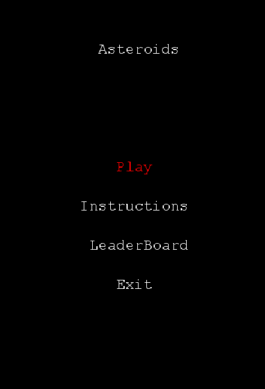
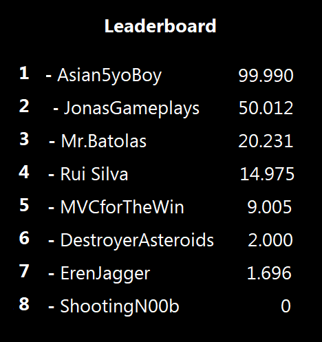
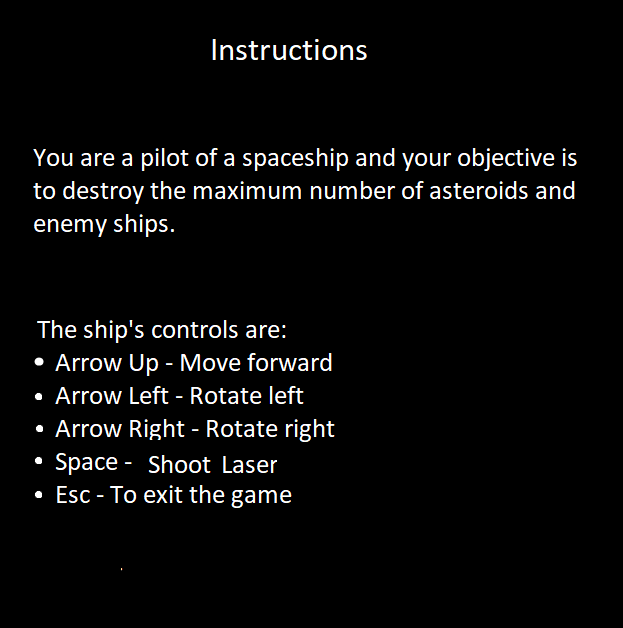

# LDTS_1304 - Asteroids

## Game Description

**Asteroids** is a space-themed multidirectional shooter arcade game where you control a spaceship to destroy asteroids and flying saucers. Be careful not to collide with the asteroids that are all around you, and avoid counter-fire from the saucers. The game becomes harder as the number of asteroids increases each time the player destroys them all. When you achieve 10000 points, you earn an extra life. The machine "turns over" at 99,990 points, which is the maximum high score that can be achieved.

This project was developed by Afonso Baldo, João Teixeira and José Gaspar for LDTS 21⁄22.

For a more detailed version of this description click [here](./docs/README.md).

## FEATURES
 - [x] Menu - When the game is initialized a Menu is displayed (the player chooses between playing, seeing leaderbord or quit)
 - [x] Movement - The spaceship is able to move in all directions when the arrow keys are pressed.
 - [x] Shooting - The spaceship can shoot laser beams. 
 - [x] Asteroids - The asteroids appear randomly throughout the map and move in a single random direction. 
 - [x] Enemy Ships - The enemy flying saucers appear randomly on the map and try to shoot at your spaceship.
 - [ ] Player Collisions - If the player collides with an asteroid, enemy ship or with a laser beam, it dies.
 - [x] Asteroids Collisions - If the asteroid collides with a ship, kills it.
 - [ ] Asteroid Splitting - The asteroids get split in half when shot by the laser beams. The smaller ones get instantly destroyed.
 - [x] Borders of the Map - When an object crosses the borders of the map, it appears on the opposite side.
 - [ ] Score - When the player destroys asteroids and enemy ships, he gains points.
 - [ ] Lives - The player has an amount of lives, that decreases everytime he dies.
 - [ ] Game Over - When the player runs out of lives, the game ends.
 - [ ] Instructions - A page that shows the basic controls for the game.
 - [ ] Leaderboard - When the user loses, his score is saved to a file.

## Screenshots 
The following screenshots ilustrate the general look of our game, as well as the functionalities: 

### Game Preview

### Menus
**Initial Menu**

**Leaderboard**

**Instructions**

### End Game

