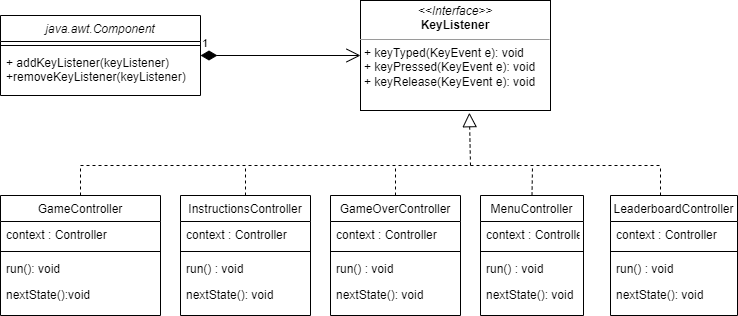
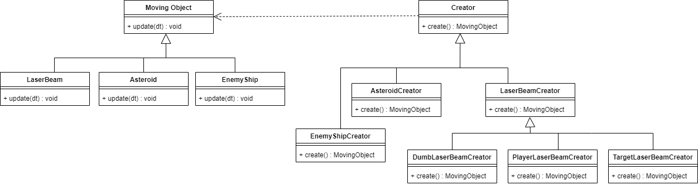
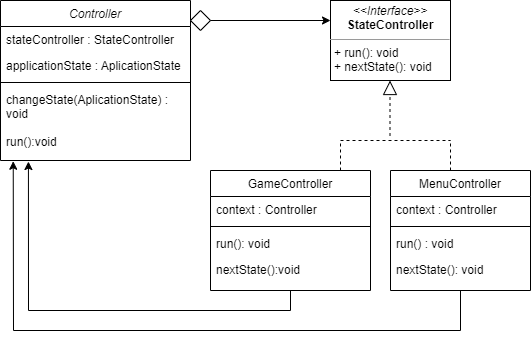
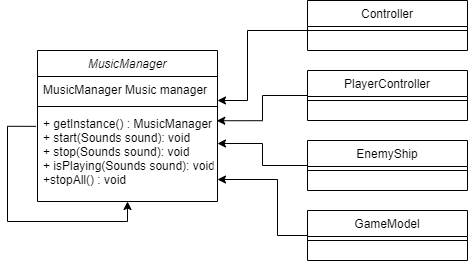
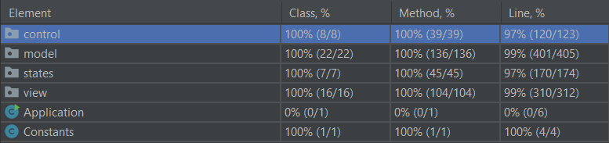
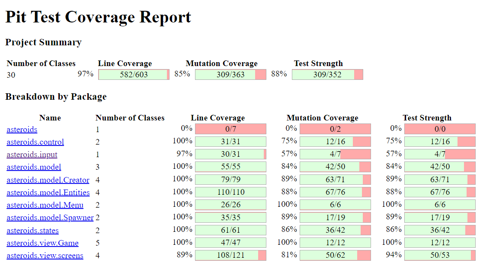

# LDTS_1304 - Asteroids

## GAME DESCRIPTION

**Asteroids** is a space-themed multidirectional shooter arcade game where you control a spaceship to destroy asteroids and flying saucers. Be careful not to collide with the asteroids that are all around you, and avoid counter-fire from the saucers. The game becomes harder as the number of asteroids increases each time the player destroys them all. When you achieve 10000 points, you earn an extra life. The machine "turns over" at 99,990 points, which is the maximum high score that can be achieved.

This project was developed by Afonso Baldo, João Teixeira and José Gaspar for LDTS 21⁄22.
## FEATURES
### IMPLEMENTED FEATURES
* Menu - When the game is initialized a Menu is displayed (the player chooses between playing, seeing leaderboard or quit)
* Movement - The spaceship is able to move in all directions when the arrow keys are pressed.
* Shooting - The spaceship can shoot laser beams. 
* Asteroids - The asteroids appear randomly throughout the map and move in a single random direction. 
* Enemy Ships - The enemy flying saucers appear randomly on the map and try to shoot at your spaceship.
* Player Collisions - If the player collides with an asteroid, enemy ship or with a laser beam, it dies.
* Asteroids Collisions - If the asteroid collides with a ship, kills it.
* Asteroid Splitting - The asteroids get split in half when shot by the laser beams. The smaller ones get instantly destroyed.
* Borders of the Map - When an object crosses the borders of the map, it appears on the opposite side.
* Score - When the player destroys asteroids and enemy ships, he gains points.
* Lives - The player has an amount of lives, that decreases everytime he dies.
* Game Over - When the player runs out of lives, the game ends.
* Instructions - A page that shows the basic controls for the game.
* Leaderboard - When the user loses, his score is saved to a file.
* SoundTrack - Play background music when user is playing.
* Sounds - Play sounds when the player or enemy fires a laser beam, or when there is a collision.
* Player Flames - When the player accelerates, we can see flames in the rocket.
* Enemy Ship Types - There are two types of ships: one tries to shoot directly at the player (Target) and the other shoots in predefined directions(Dumb).

### PLANNED FEATURES
* All feaures implemented!

## IMPLEMENTATION - UML

## DESIGN PATTERNS

### FUNDAMENTAL ORGANIZATION OF THE CODE

**Problem in Context** 

When we were organizing the project, we realized that the code would get very messy and hard to read without an appropriate structure.

**The Pattern**

We have applied the **MVC** pattern. This pattern separates the game logic from the display code, allowing us to easily fix bugs and improve code readability.

**Implementation**

The following image shows how we implemented the pattern.

These packages can be found in:

- [Controller](https://github.com/FEUP-LDTS-2021/ldts-project-assignment-g1304/tree/main/src/main/java/asteroids/control)
- [Model](https://github.com/FEUP-LDTS-2021/ldts-project-assignment-g1304/tree/main/src/main/java/asteroids/model)
- [View](https://github.com/FEUP-LDTS-2021/ldts-project-assignment-g1304/tree/main/src/main/java/asteroids/view)

**Consequences**

The use of the MVC Pattern in the current design has the following benefits:

- When we want to add a new feature to our game, the code will be more modular and organized. All we have to do is create another controller, model, or view, depending on the requirements of the new feature. Then it is easier to integrate it with the existing code.
- The code is both more readable and easier to write.
- Allows for a more adjustable code. For example, if we want to change the game's aesthetics, we can easily update its View.

However, applying MVC requires more thinking and organizing before-hand.

### INPUT MANAGEMENT

**Problem in Context**

We realized that we had to inform the objects of the application when an input was read, so it could act accordingly.

**The Pattern**

To solve this issue, we implemented the **Observer** pattern. This pattern lets you notify multiple objects about any events that happen to the object they’re observing.

**Implementation**

We implemented a class, InputListener, that works as the publisher, reading the events and notifying the interface, InputObserver, that works as the subscriber.

These classes can be found in:

- [java.awt.Component](https://docs.oracle.com/javase/7/docs/api/java/awt/Component.html)
- [KeyListener](https://docs.oracle.com/javase/7/docs/api/java/awt/event/KeyListener.html)
- [PlayerController](https://github.com/FEUP-LDTS-2021/ldts-project-assignment-g1304/blob/main/src/main/java/asteroids/control/PlayerController.java)
- [GameController](https://github.com/FEUP-LDTS-2021/ldts-project-assignment-g1304/blob/main/src/main/java/asteroids/states/GameController.java)
- [MenuController](https://github.com/FEUP-LDTS-2021/ldts-project-assignment-g1304/blob/main/src/main/java/asteroids/states/MenuController.java)
- [InstructionsController](https://github.com/FEUP-LDTS-2021/ldts-project-assignment-g1304/blob/main/src/main/java/asteroids/states/InstructionsController.java)
- [GameOverController](https://github.com/FEUP-LDTS-2021/ldts-project-assignment-g1304/blob/main/src/main/java/asteroids/states/GameOverController.java)
- [LeaderboardController](https://github.com/FEUP-LDTS-2021/ldts-project-assignment-g1304/blob/main/src/main/java/asteroids/states/LeaderboardController.java)

**Consequences**

Using the **Observer** Pattern allows to:
-   Introduce new subscriber classes without having to change the publisher’s code (and vice versa if there’s a publisher interface).
-   Establish relations between objects at runtime.

### CREATING OBJECTS

**Problem in Context**

The entitities of our game have significant similarities, but demonstrate no reuse of common interface or implementation. Considering this, if they were separate classes, when we wanted to make a change common to all the components, more effort would be expendend, because we would have to change all of the component's classes. This way, we came to the conclusion that we had to standardize an architectural model for our entities, but allow for individual applications to define their own domain objects and provide for their creation.

**The Pattern**

We decided to implement the **Factory** pattern. This design pattern defines an interface for creating objects, but lets subclasses decide which classes to instantiate.

**Implementation**

These classes can be found in:

- [MovingObject](https://github.com/FEUP-LDTS-2021/ldts-project-assignment-g1304/blob/main/src/main/java/asteroids/model/Entities/MovingObject.java)
- [LaserBeam](https://github.com/FEUP-LDTS-2021/ldts-project-assignment-g1304/blob/main/src/main/java/asteroids/model/Entities/LaserBeam.java)
- [Asteroid](https://github.com/FEUP-LDTS-2021/ldts-project-assignment-g1304/blob/main/src/main/java/asteroids/model/Entities/Asteroid.java)
- [EnemyShip](https://github.com/FEUP-LDTS-2021/ldts-project-assignment-g1304/blob/main/src/main/java/asteroids/model/Entities/EnemyShip.java)
- [Creator](https://github.com/FEUP-LDTS-2021/ldts-project-assignment-g1304/blob/main/src/main/java/asteroids/model/Creator/Creator.java)
- [DumbLaserBeamCreator](https://github.com/FEUP-LDTS-2021/ldts-project-assignment-g1304/blob/main/src/main/java/asteroids/model/Creator/DumbLaserBeamCreator.java)
- [PlayerLaserBeamCreator](https://github.com/FEUP-LDTS-2021/ldts-project-assignment-g1304/blob/main/src/main/java/asteroids/model/Creator/PlayerLaserBeamCreator.java)
- [TargetLaserBeamCreator](https://github.com/FEUP-LDTS-2021/ldts-project-assignment-g1304/blob/main/src/main/java/asteroids/model/Creator/TargetLaserBeamCreator.java)
- [LaserBeamCreator](https://github.com/FEUP-LDTS-2021/ldts-project-assignment-g1304/blob/main/src/main/java/asteroids/model/Creator/LaserBeamCreator.java)
- [EnemyLaserBeamCreator](https://github.com/FEUP-LDTS-2021/ldts-project-assignment-g1304/blob/main/src/main/java/asteroids/model/Creator/EnemyLaserBeamCreator.java)
- [AsteroidCreator](https://github.com/FEUP-LDTS-2021/ldts-project-assignment-g1304/blob/main/src/main/java/asteroids/model/Creator/AsteroidCreator.java)
- [EnemyShipCreator](https://github.com/FEUP-LDTS-2021/ldts-project-assignment-g1304/blob/main/src/main/java/asteroids/model/Creator/EnemyShipCreator.java)

**Consequences**

Using the **Factory** pattern has the following benefits:

- We managed to move the entities creation code into one place in the program, making the code easier to update.
- We can introduce new entities into the application without changing existing code.
- There is a separation between creation and the entities themselves.

### CHANGING PROGRAM STATES

**Problem in Context**

Developing the menu, we came to the conclusion that there was a finite number of states which our application could be in, at any given moment. The program needed to be able to switch from one state to another instantaneously. However, depending on a current state, the program may or may not switch to certain other states.

**The Pattern**

The most obvious solution to our problem is implementing the **State** pattern. With this pattern, we can separate all the states in individual classes and implement their specific methods in these classes.

**State diagram**

**Implementation**

These classes can be found in:
- [Controller](https://github.com/FEUP-LDTS-2021/ldts-project-assignment-g1304/blob/main/src/main/java/asteroids/control/Controller.java)
- [StateController](https://github.com/FEUP-LDTS-2021/ldts-project-assignment-g1304/blob/main/src/main/java/asteroids/states/StateController.java)
- [GameController](https://github.com/FEUP-LDTS-2021/ldts-project-assignment-g1304/blob/main/src/main/java/asteroids/states/GameController.java)
- [MenuController](https://github.com/FEUP-LDTS-2021/ldts-project-assignment-g1304/blob/main/src/main/java/asteroids/states/MenuController.java)
- [InstructionsController](https://github.com/FEUP-LDTS-2021/ldts-project-assignment-g1304/blob/main/src/main/java/asteroids/states/InstructionsController.java)
- [GameOverController](https://github.com/FEUP-LDTS-2021/ldts-project-assignment-g1304/blob/main/src/main/java/asteroids/states/GameOverController.java)
- [LeaderboardController](https://github.com/FEUP-LDTS-2021/ldts-project-assignment-g1304/blob/main/src/main/java/asteroids/states/LeaderboardController.java)

**Consequences**

Applying the **State** pattern allows to:

- Organize the code of the various states into individual classes
- Introduce new states in a much easier way, without having to change existing state classes or the context.

### USING THE SAME INSTANCE

**Problem in Context**

When adding sounds to our project, we noticed that several classes required access to a class that would manage the music. We wanted to ensure that the manager had only one instance.

**The Pattern**

To solve this issue, we implemented the **Singleton** pattern which allow us to instantiate a single object of a certain class, providing a global access point to this instance.

**Implementation***

These classes can be found in:

- [MusicManager](https://github.com/FEUP-LDTS-2021/ldts-project-assignment-g1304/blob/main/src/main/java/asteroids/control/MusicManager.java)
- [Controller](https://github.com/FEUP-LDTS-2021/ldts-project-assignment-g1304/blob/main/src/main/java/asteroids/control/Controller.java)
- [PlayerController](https://github.com/FEUP-LDTS-2021/ldts-project-assignment-g1304/blob/main/src/main/java/asteroids/control/PlayerController.java)
- [EnemyShip](https://github.com/FEUP-LDTS-2021/ldts-project-assignment-g1304/blob/main/src/main/java/asteroids/model/Entities/EnemyShip.java)
- [GameModel](https://github.com/FEUP-LDTS-2021/ldts-project-assignment-g1304/blob/main/src/main/java/asteroids/model/GameModel.java)

**Consequences**

Applying the **Singleton** pattern:

- Each time we need to access the MusicManager class we can simply get an instance of the object, so there is no need to pass it as an attribute to all the classes that use it.
- We can be sure that a class has only a single instance.
- It is harder to unit test the code of the Singleton because many test frameworks rely on inheritance when producing mock objects (we had to use a new type of mock, the MockedStatic instead of the regular Mockito).

## BETTER CODE HUB

Result of the analysis: 8/10

**Failed guidelines:**

- Separate Concerns in Modules;
- Couple Architecture Components Loosely;

These guidelines were not accomplished because we used the **MVC** pattern. This pattern pressuposes the interconnection of three layers of code (Model, View and Controller), meaning it is impossible to keep the codebase loosely coupled.

## LIST OF REFACTORINGS

### Refactoring: EnemyShipSpawner

- Extracted method chooseVelocity and choosePosition from method create
- Replaced magic numbers with symbolic constants (WIDTH, HEIGHT, MIN_VELOCITY, MAX_VELOCITY)

To see the commit, click [here](https://github.com/FEUP-LDTS-2021/ldts-project-assignment-g1304/commit/b7a9b46626132024cdef5aafd0033826934c1010).

### Refactoring: Replace ROOT path with constant

- Replaced variable with constant

To see the commit, click [here](https://github.com/FEUP-LDTS-2021/ldts-project-assignment-g1304/commit/f8d25815578cf95a361bd530349ca02302ffe146).

### Refactoring: Create enum for colors

- Replaced colours in the code with constants

To see the commit, click [here](https://github.com/FEUP-LDTS-2021/ldts-project-assignment-g1304/commit/c1614d133b2be05431f44b7e81b3fcac45593763).

### Refactoring: InstructionScreen and LeaderBoardScreen

- Extract Subclass InformationScreen from InstructionScreen and LeaderBoardScreen
- Remove unused function(getTerminalPosition)

To see the commit, click [here](https://github.com/FEUP-LDTS-2021/ldts-project-assignment-g1304/commit/0cd131ee4159a9a0903b44aeac57783c16f67435).

### Refactoring: InstructionScreen, LeaderBoardScreen and GameOverScreen

- Extract method setColor, drawRedLine and printLine
- Moved method setColor to ScreenView

To see the commit, click [here](https://github.com/FEUP-LDTS-2021/ldts-project-assignment-g1304/commit/036e2d4be3b6a9668c2e89de606e3ec16870eefe)

### Refactoring: View and ScreenView

- Extracted and moved methods setBackgroundColor and setForegroundColor

To see the commit, click [here](https://github.com/FEUP-LDTS-2021/ldts-project-assignment-g1304/commit/fa473035a4a03f476e31473518778f978e29d9a2)

### Refactoring: Rename Constants class

- Rename Class Constraints to Constants

To see the commit, click [here](https://github.com/FEUP-LDTS-2021/ldts-project-assignment-g1304/commit/b98989f9ca09c804299443c4f7ef919969f30cd2)

### Refactoring: Using KeyListener instead of ReadKey

- Substitute Algorithm to read inputs from the user

To see the commit, click [here](https://github.com/FEUP-LDTS-2021/ldts-project-assignment-g1304/commit/5ec31f15bc9ee05e03e9b9607b17333c814b339c)

### Refactoring: ScreenView

- Changing variable type from Screen to TerminalScreen

To see the commit, click [here](https://github.com/FEUP-LDTS-2021/ldts-project-assignment-g1304/commit/6ec1364f67655634c36744148c170152a963a1db)

### Refactoring: Vector2d

- Move Vector2d out of a package

To see the commit, click [here](https://github.com/FEUP-LDTS-2021/ldts-project-assignment-g1304/commit/50d8b88de19f1af3d6d64685244db31af3e12935)

### Refactoring: GameScreen

- Extract method getView from GameScreen

To see the commit, click [here](https://github.com/FEUP-LDTS-2021/ldts-project-assignment-g1304/commit/fe6192067da4184ed20c4d8c59f1ed0afe478d21)

### Refactoring: Entities

- Merged all entities of the game to one list

To see the commit, click [here](https://github.com/FEUP-LDTS-2021/ldts-project-assignment-g1304/commit/ab8f2e9100374e840857b085a325f4e68ff5ed38)

### Refactoring: View and ScreenView

- Removed inheritance between View and ScreenView

To see the commit, click [here](https://github.com/FEUP-LDTS-2021/ldts-project-assignment-g1304/commit/f1381ce8085cf4d11a1ebe99c4ee98c26aa0a039)

### Refactoring: Package Entities

- Moving class Player to a new package Entities

To see the commit, click [here](https://github.com/FEUP-LDTS-2021/ldts-project-assignment-g1304/commit/337df16f898369b30131807ac5aa12e958cc2ec6)

## ERROR-PRONE WARNINGS

src\main\java\asteroids\view\Color.java:18

warning: [ImmutableEnumChecker] enums should be immutable: 'Color' has field 'color' of type 'com.googlecode.lanterna.TextColor', the declaration of type 'com.googlecode.lanterna.TextColor' is not annotated with @com.google.errorprone.annotations.Immutable
    private final TextColor color;
    
Justification: The error-prone analysis does not recognize TextColor as an immutable type because it belongs to the Lanterna Library. However, TextColor is, in fact, an immutable type.

## TEST COVERAGE

## MUTATION TESTING

